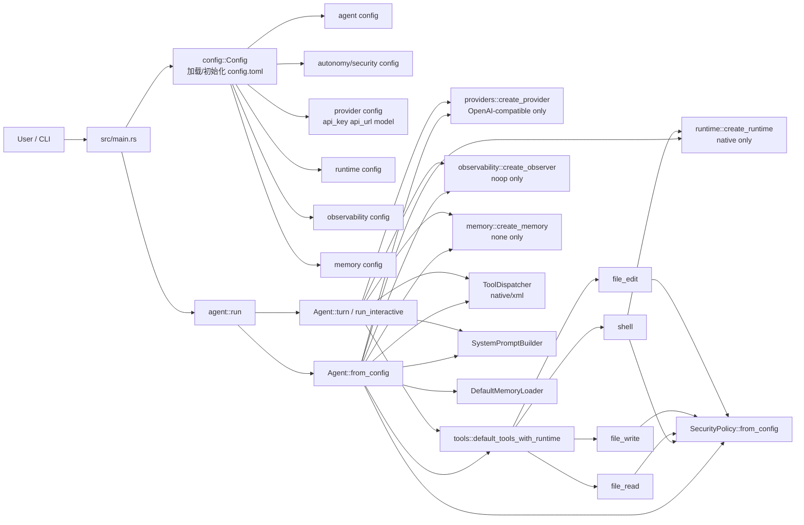
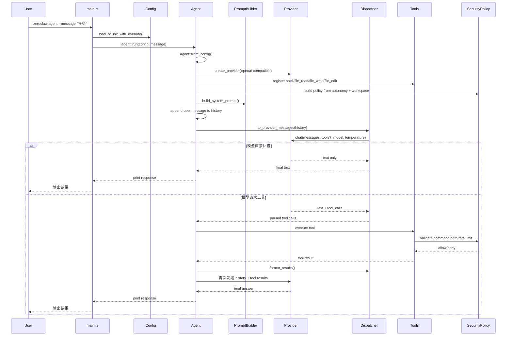

# 最小版本架构分析

去掉所有额外代码，只剩余7000行代码。分布在11个模块上。代码较多的是agent和providers。其他都很少。而且观察业务流程和模块的话，rust代码很清晰。

## 主要模块
- main：只保留 zeroclaw agent 命令，负责解析 CLI 参数并加载配置。
- config：负责创建/读取 config.toml 和 workspace 目录，最关键字段是 api_key、api_url、default_model、default_temperature。
- agent：系统核心，负责装配 provider、tools、security、runtime、memory、observer，并驱动对话循环。
- providers：只剩一个 openai-compatible provider，统一对接 OpenAI 风格接口。
- tools：只保留 4 个工具：shell、file_read、file_write、file_edit。
- security：负责工作区边界、命令白名单、危险路径拦截、动作频率限制。
- runtime：只剩 native，本地直接执行 shell 命令。
- memory：只剩 none，是空实现，不做持久记忆。
- observability：只剩 noop，接口还在，但默认不输出额外观测。
- dispatcher：负责把模型输出解析成工具调用，再把工具结果重新包装回模型上下文。
- prompt：负责生成 system prompt，注入工具说明、安全约束、工作区路径、时间和运行时信息。

下面这套图是按当前“最小化版本”的真实代码画的，主入口在 src/main.rs，装配核心在 src/agent/agent.rs，最小工具集在 src/tools/mod.rs。
架构图

## 关键路径流程图

## 一句话理解
这个最小版本质上就是：
CLI -> Config -> Agent -> OpenAI-compatible Provider + 4个本地工具 -> Security约束 -> 输出结果
不再包含 gateway、daemon、channels、硬件、浏览器工具、多 provider 路由、持久 memory backend 这些外围系统。
如果你要，我可以下一条继续给你一版“适合贴到 README 的精简版架构说明”，或者再补一张“启动装配流程图”。
